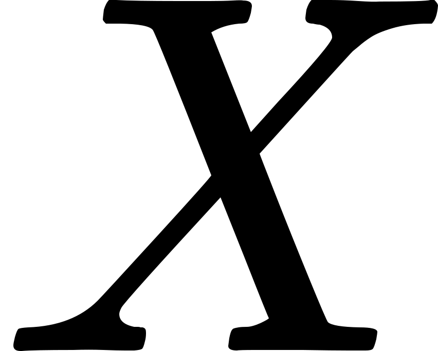
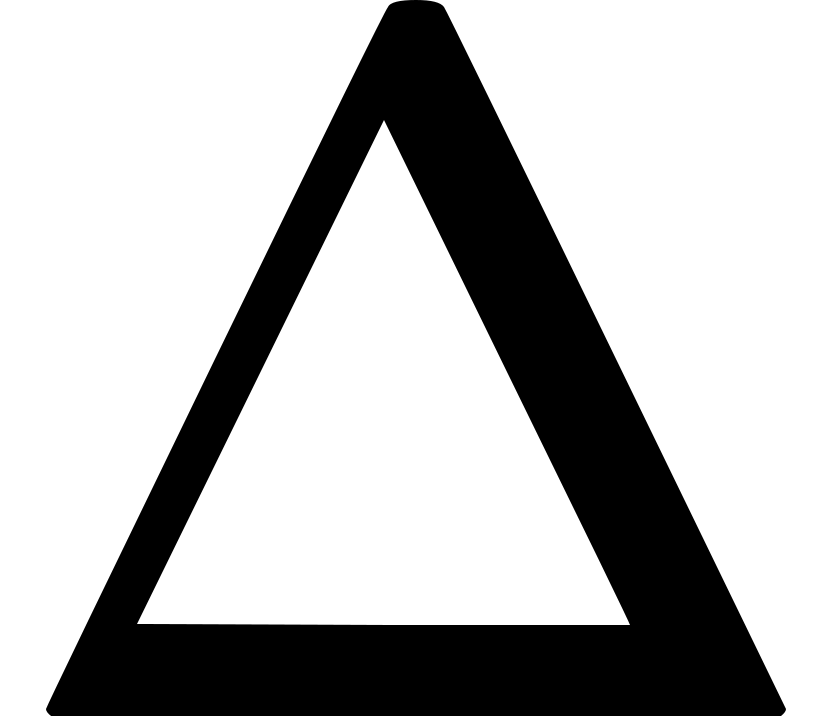
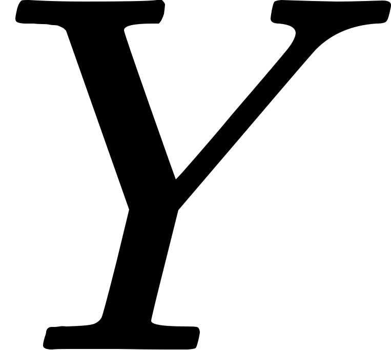
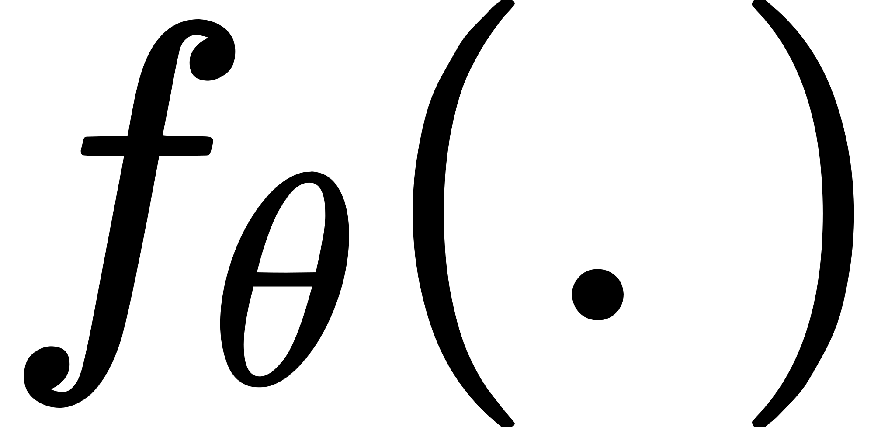
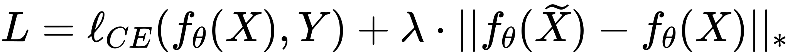
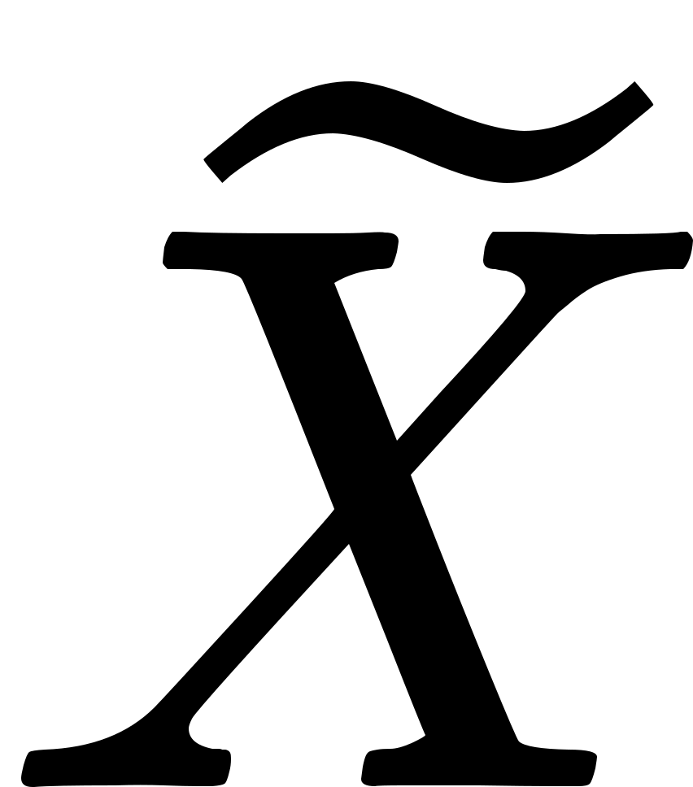

# Towards Efficient and Effective Adversarial Training

This repository contains code for the implementation of our NeurIPS 2021 paper [Towards Efficient and Effective Adversarial Training](https://papers.nips.cc/paper/2021/hash/62889e73828c756c961c5a6d6c01a463-Abstract.html). 
Accompanying resources can be found here: [[video](https://neurips.cc/virtual/2021/poster/26270)] [[poster](https://drive.google.com/file/d/1dZRYOPIVM0nU1y502OlwoLd3a6DOMCus/view?usp=sharing)]

- We propose single-step Nuclear Norm Adversarial Training (NuAT), and a two step variant
of the same (NuAT2), coupled with a novel cyclic-step learning rate schedule, to achieve
state-of-the-art results amongst efficient training methods, and results comparable to the
effective multi-step training methods.
- We demonstrate improved performance by using exponential averaging of the network
weights coupled with cyclic learning rate schedule (NuAT-WA).
- We propose a two-step variant NuAT2-WA, that utilizes stable gradients from the weight-averaged model for stable initialization in the first attack step, yielding improved results.
- We improve the stability and performance of the single-step defense (NuAT) further at a
marginal increase in computational cost, by introducing a hybrid approach (NuAT-H) that
switches adaptively between single-step and two-step optimization for attack generation.


Trained model checkpoints can be found [here](https://drive.google.com/drive/folders/1YVUAkccrIF0-tFFyE8ia36WWcQzrbk7_?usp=sharing).


# Nuclear Norm Adversarial Training (NuAT)

In this work, we propose a novel Nuclear Norm regularizer to improve the adversarial robustness of Deep Networks through the use of single-step adversarial training. Training with the proposed Nuclear Norm regularizer enforces function smoothing in the vicinity of clean samples by incorporating joint batch-statistics of adversarial samples, thereby resulting in enhanced robustness.

Nuclear-Norm based Attack: In a given minibatch, we consider <!-- $X$ -->  to be the matrix composed of vectorized pixel values (arranged row-wise) of each image, <!-- $\Delta$ -->  to be a matrix of the same dimension as <!-- $X$ -->  consisting of independently sampled Bernoulli noise, and <!-- $Y$ -->  to be the matrix containing the corresponding ground truth one-hot vectors. The following loss function which utilizes the pre-softmax values <!-- $f_\theta(.)$ -->  is maximized for the generation of single-step adversaries: 
<p align="center">
<!-- $ \widetilde{L} = \ell_{CE}(f_{\theta} (X + \Delta) , Y ) + \lambda \cdot || f_{\theta} (X+\Delta) - f_{\theta} (X) ||_*$ --> 
</p>
In single-step Nuclear Norm Adversarial Training (NuAT), the following loss function is minimized during training:
<p align="center">
<!-- $ L = \ell_{CE}(f_{\theta} (X) , Y ) + \lambda \cdot || f_{\theta} (\widetilde{X}) -  f_{\theta} (X) ||_* $ --> 
</p>
The first term in the above equation corresponds to the cross-entropy loss on clean samples, and the second term corresponds to the Nuclear-Norm of the difference in pre-softmax values of clean images <!-- $X$ -->  and their corresponding single-step adversaries <!-- $\widetilde{X}$ --> .


## Results on CIFAR-10

We summarise the robust white-box evaluations on the CIFAR-10 dataset below. We kindly refer the reader to our [paper](https://papers.nips.cc/paper/2021/hash/62889e73828c756c961c5a6d6c01a463-Abstract.html) for further details on the two-step adversarial training method (NuAT2), exponential weight averaging (NuAT-WA) and Hybrid Nuclear Norm Adversarial Training (NuAT-H).

<p align="left">
    
</p>


## Environment Settings
+ Python: 3.6.8
+ PyTorch: 1.6.0+cu101
+ TorchVision: 0.7.0+cu101


## Citing this work
```
@inproceedings{
sriramanan2021towards,
title={Towards Efficient and Effective Adversarial Training},
author={Gaurang Sriramanan and Sravanti Addepalli and Arya Baburaj and Venkatesh Babu Radhakrishnan},
booktitle={Advances in Neural Information Processing Systems},
editor={A. Beygelzimer and Y. Dauphin and P. Liang and J. Wortman Vaughan},
year={2021},
url={https://openreview.net/forum?id=kuK2VARZGnI}
}
```

